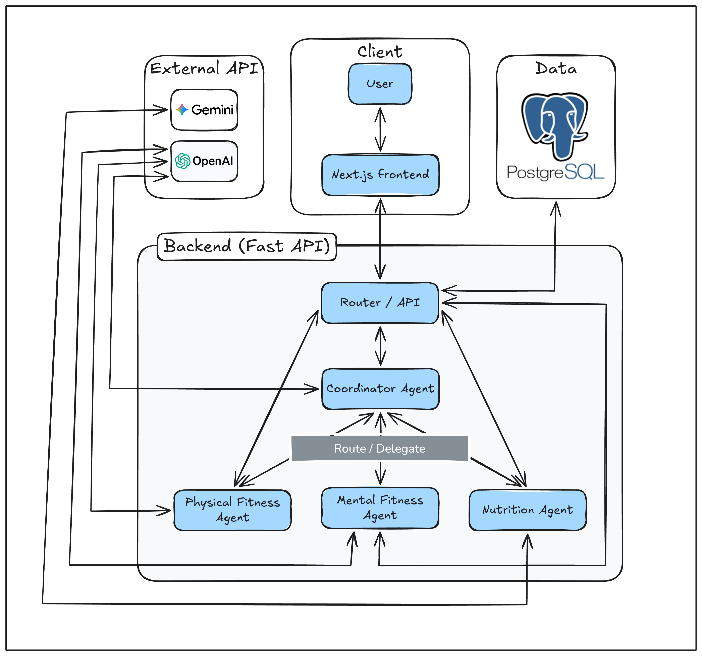

# Holos - AI Fitness Application
Three domain-specialized agents — fitness, nutrition, and mental health — coordinated by a fourth, with shared medical context and vision-based meal logging.

---

## 1. What Holos Is

FastAPI backend, Next.js frontend, PostgreSQL, and a mix of OpenAI and Google Gemini under the hood. Three domain agents handle fitness, nutrition, and mental health. A coordinator sits on top, routing your message to the right agent or pulling from all three when needed.

### Tech Stack

| Layer | Technology |
|---|---|
| Backend | FastAPI, Python 3.12+ |
| Frontend | Next.js 20+, React |
| Database | PostgreSQL 14+ |
| ORM / Migrations | SQLAlchemy, Alembic |
| Agent Framework | LangChain |
| LLM — Physical, Mental, Coordinator | OpenAI |
| LLM — Nutrition + Vision | Google Gemini |
| Web Search | Tavily (optional) |
| Auth | JWT |

Here's what it actually does:

- **Physical Fitness** (OpenAI): Workout planning and exercise recommendations, cross-checked against your medical history before suggesting anything
- **Nutrition** (Gemini): Meal planning with location-aware suggestions. Take a photo of your food, it'll pull the calories and macros out of it
- **Mental Fitness** (OpenAI): Mindfulness and stress management
- **Coordinator** (OpenAI): Figures out who to talk to, or builds a cross-domain plan if your question doesn't fit neatly into one box
- Conversation history and images persist across sessions — it remembers what you said last time
- Logs for workouts, nutrition, and mental fitness, all accessible from the dashboard

---

## 2. Architecture

<p align="center">
  
</p>

Standard three-tier setup. The Next.js frontend talks to FastAPI over REST with JWT auth. The backend has one route per agent plus routes for auth, medical history, preferences, conversation, and logs. The coordinator either handles the message itself or delegates to a domain agent. Physical fitness and mental health use OpenAI; nutrition uses Gemini including vision for food images. Everything persistent — users, preferences, medical data, messages, logs — lives in PostgreSQL.

---

## 3. Repo Layout

```
holos/
├── backend/
│   ├── app/
│   │   ├── agents/             # LangChain: physical, nutrition, mental, coordinator
│   │   ├── models/             # SQLAlchemy models
│   │   ├── routers/            # Auth, medical, preferences, agents, conversation, logs
│   │   ├── services/           # Business logic, context, tools, caches
│   │   ├── schemas/            # Pydantic
│   │   ├── database.py
│   │   ├── dependencies.py
│   │   └── main.py
│   ├── alembic/                # Migrations
│   ├── requirements.txt
│   └── .env.example
├── frontend/
│   ├── app/                    # Pages: /, /login, /register, /onboarding, /dashboard, /medical, /preferences
│   ├── components/
│   ├── lib/                    # API client
│   └── public/
├── SETUP_GUIDE.md
├── API_ROUTES_SUMMARY.md
└── TESTING.md
```

---

## 4. Setup

**You'll need:** Python 3.12+, Node.js 20+ (developed on 24.11+), PostgreSQL 14+, and API keys for OpenAI and Google Gemini. Tavily is optional if you want web search.

### Backend

```bash
cd backend
python3 -m venv venv
source venv/bin/activate   # Windows: venv\Scripts\activate
pip install -r requirements.txt
cp .env.example .env       # fill this in
createdb holos_db
python setup_database.py   # or: alembic upgrade head
uvicorn app.main:app --reload
```

API runs at `http://localhost:8000`. Swagger at `http://localhost:8000/docs`.

### Frontend

```bash
cd frontend
npm install
# create .env.local with: NEXT_PUBLIC_API_URL=http://localhost:8000
npm run dev
```

App runs at `http://localhost:3000`.

### Environment Variables

**`backend/.env`**

| Variable | What it's for |
|---|---|
| `DATABASE_URL` | PostgreSQL connection string |
| `JWT_SECRET_KEY` | Min 32 chars — `openssl rand -hex 32` works |
| `JWT_ALGORITHM` | Algorithm for JWT signing |
| `JWT_ACCESS_TOKEN_EXPIRE_MINUTES` | Default 1440 |
| `OPENAI_API_KEY` | Physical, Mental, Coordinator agents |
| `GOOGLE_GEMINI_API_KEY` | Nutrition agent + vision |
| `TAVILY_API_KEY` | Optional, web search |

**`frontend/.env.local`**

| Variable | What it's for |
|---|---|
| `NEXT_PUBLIC_API_URL` | Backend base URL, e.g. `http://localhost:8000` |

Full setup walkthrough and troubleshooting in **SETUP_GUIDE.md**.

---

## 5. How It Works End to End

### Auth

Register via `POST /auth/register`, login via `POST /auth/login`. The backend hands back a JWT. Every protected route expects `Authorization: Bearer <token>`.

### Onboarding

After registering, the frontend walks you through `/onboarding` — medical history first, then preferences. This data feeds directly into agent context so the system knows what to avoid and what to optimise for before you say a word.

### Agent Chat

From the dashboard, you pick an agent, type your message, optionally attach an image (Nutrition or Coordinator). The backend routes it to the right place:

- `POST /agents/physical-fitness/chat`
- `POST /agents/nutrition/chat` — accepts `image_base64`, returns macro breakdown
- `POST /agents/mental-fitness/chat`
- `POST /agents/coordinator/chat` — routes or builds a cross-domain plan

### Conversation and Images

Two ways to handle images:

**Option A — Analysis only, no persistence:** Send `image_base64` directly to the nutrition or coordinator endpoint. Gets you the analysis, nothing stored.

**Option B — Persist it:**
1. `POST /conversation/upload-image` with `image_base64` → get back `image_path`
2. `POST /conversation/messages` with `image_path` to save the message
3. Still send `image_base64` to the agent endpoint if you want the nutrition analysis in the same turn

The backend handles both raw base64 and data URLs for image uploads — strips the prefix itself. For agent requests, just send raw base64, which is what the dashboard does anyway.

### Logs

Three log endpoints, all paginated, all require auth:

- `GET /logs/workouts`
- `GET /logs/nutrition`
- `GET /logs/mental-fitness`

Dashboard has a modal with tabs for all three.

---

## 6. API Reference

| Area | Method | Path | Notes |
|------|--------|------|-------|
| Auth | POST | `/auth/register` | email, username, password |
| Auth | POST | `/auth/login` | email, password → JWT |
| Medical | GET | `/medical/history` | current user |
| Medical | POST | `/medical/history` | create/update |
| Prefs | GET | `/preferences` | current user |
| Prefs | POST | `/preferences` | create/update |
| Agents | POST | `/agents/physical-fitness/chat` | `message` |
| Agents | POST | `/agents/nutrition/chat` | `message`, optional `image_base64` |
| Agents | POST | `/agents/mental-fitness/chat` | `message` |
| Agents | POST | `/agents/coordinator/chat` | `message`, optional `image_base64` |
| Conv | POST | `/conversation/messages` | save message, optional `image_path` |
| Conv | GET | `/conversation/messages` | list messages |
| Conv | DELETE | `/conversation/messages` | clear history |
| Conv | POST | `/conversation/upload-image` | `image_base64` → `image_path` |
| Conv | GET | `/uploads/images/{filename}` | serve stored image |
| Logs | GET | `/logs/workouts` | pagination |
| Logs | GET | `/logs/nutrition` | pagination |
| Logs | GET | `/logs/mental-fitness` | pagination |

Full request/response shapes at `http://localhost:8000/docs` when the backend is running.

---

## 7. Database Models

- **User** — email, username, password hash, timestamps
- **MedicalHistory** — conditions, limitations, medications, notes
- **UserPreferences** — goals, dietary restrictions, location, exercise types, activity level
- **ConversationMessage** — role, content, warnings, image path, agent type, timestamps
- **WorkoutLog, NutritionLog, MentalFitnessLog** — per-user activity logs
- **AgentExecutionLog** — optional agent run tracing

Models in `backend/app/models/`, migrations in `backend/alembic/`.

---

## 8. Frontend Pages

- `/` — home
- `/login`, `/register` — auth; register leads to onboarding
- `/onboarding` — medical history → preferences → dashboard
- `/dashboard` — agent selector, chat, image upload, logs modal
- `/medical` — view/edit medical history
- `/preferences` — view/edit preferences

---

## 9. Known Limitations

- **LangChain version compatibility:** Pinned in `requirements.txt`. If you hit `ImportError: cannot import name 'ModelProfileRegistry'`, check `backend/TESTING_INSTRUCTIONS.md` for the fix.
- **Rate limiting:** Middleware exists at `backend/app/middleware/rate_limit.py` but isn't mounted in `main.py`. Wire it up before going anywhere near production.
- **Tests:** `pytest` is in requirements, test scripts are referenced in docs but not in the repo yet. Worth adding before this scales.
- **Common friction:** CORS issues → set frontend origin in `CORS_ORIGINS`. 401s → check token storage. Agent silent → check API keys in `.env` and backend logs.

---

## 10. Other Docs

- **SETUP_GUIDE.md** — full install and troubleshooting
- **TESTING.md** — end-to-end test flow
- **API_ROUTES_SUMMARY.md** — agent routes and request/response notes
- **backend/TESTING_INSTRUCTIONS.md** — LangChain version notes

---

## License

MIT